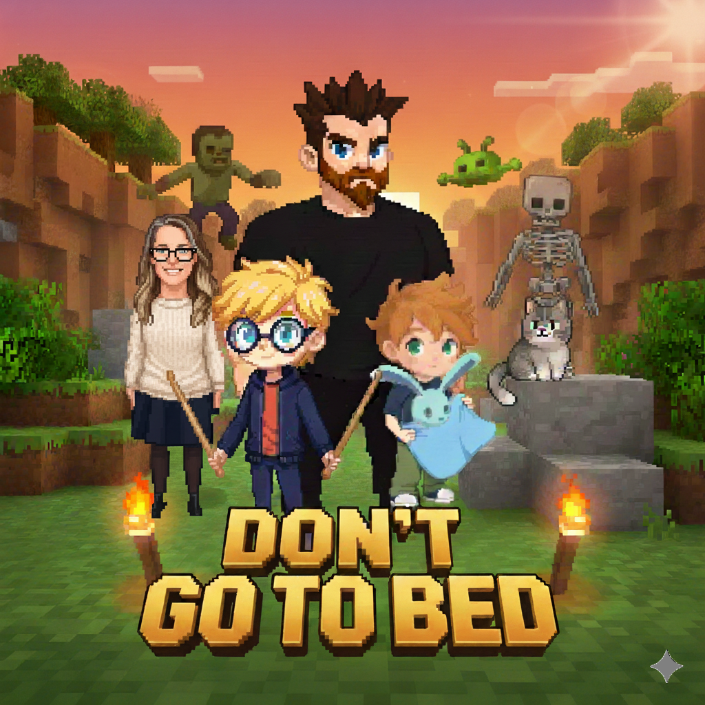
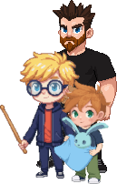

# Dont go To Bed

A cozy, chaotic, family-designed 2.5D multiplayer adventure — built in pure Kotlin with no external game engine. Break blocks, craft, bonk baddies, and team up to find Mammy before dreamland arrives and the monsters return.

---

## Story
The dreamland can be a scary place, sometimes monsters appear, thankfully, we have the weapons and skills required to defeat and protect ourselves from these monsters. Our goal is to find the mammy, who left us early in the morning and the daddy cant remember where she went because she didnt put it in the calender. All she left us with is a note 'Gone to *unreadable scribble*, see you there, if not, dont go to bed without me'. We have to journey to find the mammy, before the dreamland comes, where the monsters might return

---

## What is this?
- Designed by Leo (7), Ian (4) and James (Daddy).
- A 2.5 dimensional, Minecraft + Super Mario Bros–inspired, pure Kotlin, engineless game.
- The main designers are Leo and Ian. The main dev is Junie (because Daddy isn’t allowed to spend time on boring-looking things) — so don’t blame Junie fully for the code quality.
- Status: very, very, very early development. Not everything is done yet. There’s a roadmap… currently in Leo’s scrapbook.

---

## Game Play Premise
There are 3 playable characters. You can build, fight and jump your way around the world. The blocks can be broken, collected and reused. You can collect items, craft, create and use weapons against enemies such as the zombie, skeleton, alien and beast. There will be different levels to play, each adding to the storyline.

The multiplayer is done via websocket connection, syncing the world and players.

---

## Screenshots & Art
Some of the characters and enemies you’ll encounter are in `app/src/main/res/drawable/`:
- leo_front.webp, ian_front.png, papa_front.png (+ walk/side variants)
- zombie, skeleton, alien sprites
- together.png, mammy.png

---

## Features (WIP)
- 2.5D side-scrolling platforming with building and destructible tiles
- Collect, reuse, and craft from broken blocks
- Melee actions ("hit") and jumping
- Basic enemy roster: zombie, skeleton, alien, beast (assets in repo; behaviors evolving)
- Local multiplayer over WebSocket (host one device, others join)
- Pure Kotlin + Jetpack Compose UI; no external game engine

---

## Tech Stack
- Language: Kotlin (Android)
- UI: Jetpack Compose
- Multiplayer: org.java_websocket
  - Default port: 8082
  - Default client host IP: 127.0.0.1 (overridden at runtime with the host’s local IP)
- Min/target SDK: defined in Gradle; open with latest Android Studio

Key classes:
- MainActivity — game loop, UI, tile map, physics, and input handling
- MultiplayerManager — lightweight WebSocket client/server, simple pipe-delimited protocol (INPUT, POS, TILE, CHAR)

---

## Build & Run (Android)
1. Open the project in Android Studio (Giraffe+ recommended).
2. Let Gradle sync and build.
3. Run on at least two devices/emulators connected to the same network.
4. In-app:
   - Choose your character (Leo, Ian, or Papa).
   - One device selects Host to start the WebSocket server.
   - Other devices select Join and enter the host device’s local IP address.
   - Port is 8082 by default.

Tip: The app shows the device’s local IP to help others join. Make sure devices are on the same Wi‑Fi/VLAN and that the network allows local connections.

---

## Controls (current defaults)
- Move Left/Right: on-screen buttons
- Jump: on-screen button
- Hit/Break: on-screen button (damages or breaks tiles; broken tiles can be reused)

Note: Controls and mechanics are evolving quickly.

---

## Protocol (for tinkerers)
MultiplayerManager uses a tiny text protocol over WebSocket:
- INPUT|<l>|<r>|<j>|<h> where each flag is 1/0
- POS|<xDp>|<heightPx>
- TILE|destroy|<x>|<y>
- CHAR|<name>

Logs are printed with tag "Multiplayer" for debugging.

---

## Project Structure (high level)
- app/src/main/java/dev/jamescullimore/dontgotobed/
  - MainActivity.kt — game UI/logic
  - MultiplayerManager.kt — WebSocket hosting/joining and message handling
- app/src/main/res/drawable/ — sprites and images (including poster.png)
- app/src/main/res/values/ — themes, strings, colors

---

## Roadmap
- More levels tied to the storyline
- Crafting system and inventories
- Additional enemy behaviors and AI
- Polished physics, collisions, and VFX

(And whatever Leo’s scrapbook says next!)

---

## Credits
- Game design: Leo (7), Ian (4)
- Development: Junie (with oversight by James/Daddy)
- Inspiration: Minecraft, Super Mario Bros.

Art, names, and story belong to the family creators of this project.

---

## License
TBD — currently no explicit open-source license. Please ask before reusing assets or code.
