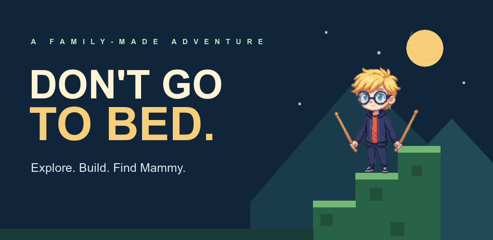
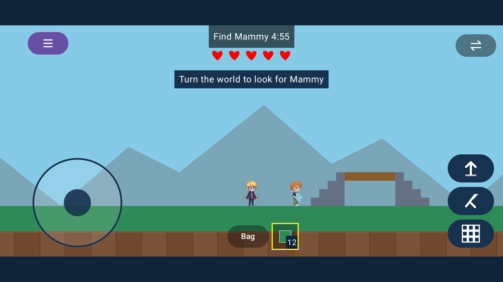

# Don't Go To Bed

A cozy, chaotic, family-designed **2.5D multiplayer adventure**. Build a route,
bonk a zombie, turn the whole world… and find Mammy before dark.

Made by **Leo, Ian and James (Daddy)** with Kotlin Multiplatform and Compose
Multiplatform. No external game engine. A fairly ambitious use of a pocket full of dirt.

**Android · iPhone · iPad** — currently preparing the first store release.
All gameplay is free; optional grown-up tips unlock nothing.

[Build and contribute](CONTRIBUTING.md) · [Roadmap](ROADMAP.md) ·
[Code and asset licenses](LICENSING.md)

---

## The story

Mammy left early. Daddy can't remember where she went because she didn't put it
in the calendar. All she left was a note:

> Gone to *unreadable scribble*. See you there. If not, don't go to bed without me.

Time to find her before dreamland arrives and the monsters come out.
We have three adventurers, some building blocks and a plan.
The plan is mostly building blocks.

## What is this?

- Designed by the boys, built together as a family.
- Inspired by Minecraft, Super Mario Bros. and the things in Leo's scrapbook.
- Shared Kotlin gameplay and Compose UI across Android and iOS.
- A playable game in release preparation: store setup, real purchase tests and
  the final physical multiplayer/device checks are still outstanding.

The original Android project grew into this multiplatform version. The original Android version remains in Git history; this tree contains the current game.

## Play together

Two players really are in that scene: Leo and Ian, connected through the ordinary
Host/Join flow on two Android emulators. This is a real session screenshot, not a
composite of separate characters. Physical Android/iOS cross-play still needs its
final release checks.

1. Connect devices to the same trusted Wi-Fi network.
2. On one device, select **Host**, then choose a character.
3. On another, select **Join** and enter the host's displayed local IP address.
4. Join with another character and set off together.

Use the same game version on every device. iOS may ask for local-network access.
The host runs a local WebSocket server on port `8082`; there is no hosted game
backend, public matchmaking or public chat. Connections are unencrypted, so use a
trusted network. `127.0.0.1` refers to the same device, not another player's phone.

## What's playable now?

- **Leo, Ian and Papa:** choose a character and explore on your own or together.
- **A world you can turn:** switch between latitude and longitude to discover
  another route through houses, bridges, gardens and mountains.
- **Build your own way:** break, collect and place grass, wood and stone blocks;
  select materials and shapes from the bag.
- **Cartoon trouble:** zombies, skeleton archers, melee attacks, arrows and potions.
- **Find Mammy:** five minutes to find her, a night-time hunt if you're late,
  and five peaceful minutes when you succeed.
- **The dangerous bed:** a nightfall obstacle with map and supply rewards when
  broken. The map helps you navigate. Landing on the bed is a bad plan.
- **Music and effects:** menu, search and panic music with fades; sounds for
  jumping, hitting, placing, arrows, damage, potions and turning the world.
- **Saved settings:** separate music/effect volumes, world settings, direction
  buttons, reduced motion and reduced flashes. Audio credits are beside the sliders.
- **A fresh adventure each session:** settings persist; worlds do not. Solo play
  pauses in the menu/background. Multiplayer ends locally when backgrounded.

Crafting, character-specific special moves and the larger enemy roster are
**future ideas**, not features being advertised for this release.

## Controls

| Control | Action |
| --- | --- |
| Joystick / optional direction buttons | Move and aim |
| Jump | Jump over trouble |
| Hit | Attack or break a targeted block |
| Place / Use | Place the selected block or use a compatible item |
| Bag | Select items; long-press a material stack for shapes |
| Turn | Explore the other world direction |
| Map, when owned | Show the world overview |
| Menu | Settings, help and leaving the session; pauses solo play |

## Trailer

[Watch the narrated trailer on YouTube](https://youtu.be/JN5BdB0Ek_c).
Real Android gameplay, including two-player multiplayer. Store release is still in preparation.

## Build and contribute

See [CONTRIBUTING.md](CONTRIBUTING.md) for Android/iOS setup, audio prerequisites,
tests and local configuration. Original licensed MP3s are supplied separately;
a public checkout requires licensed replacements before running the game.

## Project layout

- `composeApp/`: shared gameplay, UI, resources, tests and platform integrations.
- `iosApp/`: native Apple host and shared Xcode schemes.
- `scripts/`: build, audio preparation and diagnostic helpers.
- `docs/images/`: selected README images.

Publisher release instructions, website sources and production media are supplied
privately in an ignored ZIP handoff. They are not needed to contribute game code.

## Licence

Code is [MIT licensed](LICENSE). Family artwork and identity have
[separate terms](LICENSING.md). Published forks must replace the family branding
and obtain their own rights for third-party assets.
